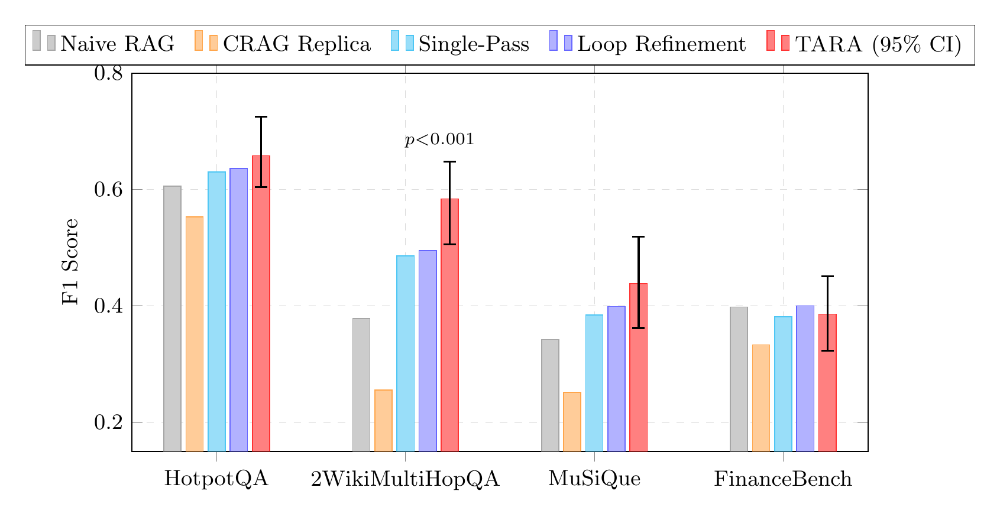
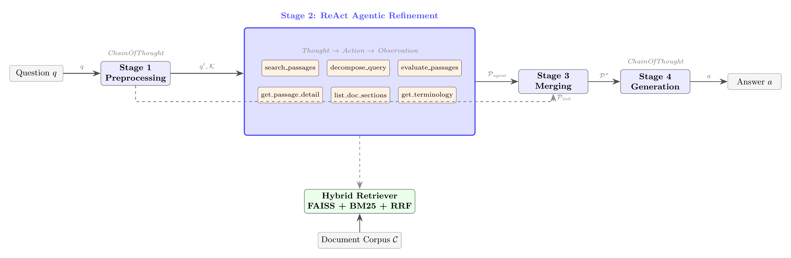

# TARA: 도구 강화 ReAct 에이전트를 통한 복잡도 적응형 검색 정제

[English](README.md) | [한국어](#개요)

[](paper/main.pdf)
[](LICENSE)
[](https://www.python.org/)
[](https://github.com/stanfordnlp/dspy)

---

## 개요

**TARA**는 고정 루프 기반 자기 교정 RAG를 **ReAct 기반 에이전트** + 6개 전문 도구로 대체하는 프레임워크입니다. 전체 파이프라인은 **DSPy 선언적 프로그램**으로 구현되어 자동 프롬프트 최적화가 가능합니다.

> **투고 저널**: Knowledge-Based Systems (Elsevier, SCIE Q1, IF 7.6)

### 핵심 기여

1. **도구 강화 에이전틱 정제** — ReAct 에이전트가 4개 핵심 + 2개 도메인 적응형 도구로 검색 전략을 자율적으로 결정
2. **다차원 품질 평가** — 4차원 평가(관련성, 커버리지, 구체성, 충분성)를 에이전트 도구로 활용
3. **구조 인식 검색** — 문서 섹션 탐색 및 용어 매핑으로 기업 문서 대응
4. **DSPy 선언적 파이프라인** — 타입 시그니처 + BootstrapFewShot/MIPROv2 자동 최적화

### 주요 결과

| 데이터셋 | TARA (F1) | Loop (F1) | 차이 | p-value |
|----------|-----------|-----------|------|---------|
| **2WikiMultiHopQA** | **.584** | .495 | **+.089** | **<.001** |
| MuSiQue | **.438** | .399 | +.039 | .161 |
| HotpotQA | **.658** | .636 | +.022 | .772 |
| FinanceBench | .386 | **.400** | -.014 | .394 |

*Gemini Flash Lite, n=200, paired bootstrap 유의성 검정 (Bonferroni 보정)*

<p align="center">
  
</p>

**핵심 발견**: 에이전틱 이점은 **복잡도에 비례** — 4-hop 질문에서 +0.305 F1, 단순 질문에서는 미미.

---

## 아키텍처

<p align="center">
  
</p>

파이프라인은 4단계로 구성됩니다: (1) 질문 전처리, (2) 6개 전문 도구를 활용한 ReAct 에이전틱 정제, (3) 패시지 병합, (4) 답변 생성. 패시지가 전혀 검색되지 않는 극단적 경우를 위한 3-way 폴백 라우터(Clarification / DomainExpert / Fallback)가 구현되어 있으나, 실제 실험에서는 거의 트리거되지 않습니다.

---

## 빠른 시작

### 1. 환경 설정

```bash
git clone https://github.com/comsa33/self-corrective-rag.git
cd self-corrective-rag
cp .env.example .env    # API 키 설정
uv sync                 # 의존성 설치
```

### 2. `.env` 설정

```env
GEMINI_API_KEY=your-key-here
PREPROCESS_MODEL=gemini/gemini-3.1-flash-lite-preview
EVALUATE_MODEL=gemini/gemini-3.1-flash-lite-preview
GENERATE_MODEL=gemini/gemini-3.1-flash-lite-preview
AGENT_MODEL=gemini/gemini-3.1-flash-lite-preview
EMBEDDING_MODEL=all-MiniLM-L6-v2
```

### 3. 데이터 준비

```bash
uv run python scripts/prepare_datasets.py --sample 500
uv run python scripts/build_index.py --dataset all
```

### 4. 실험 실행

```bash
# 단일 RQ
uv run python experiments/run.py --config configs/experiment/rq1.yaml --sample 20

# 전체 실험
uv run python experiments/run.py --all --sample 200 --delay 0
```

---

## 저장소 구조

```
agentic_rag/
  config/          설정, 프롬프트, YAML 설정 로더
  retriever/       FAISS + BM25 하이브리드 검색, 섹션/용어 인덱스
  signatures/      DSPy 시그니처 (전처리, 평가, 생성, 에이전트)
  tools/           6개 에이전트 도구 (검색, 분해, 평가, 상세조회, 구조, 용어)
  pipeline/        파이프라인 구현 (naive, crag, loop, agentic)
  evaluation/      메트릭 (EM, F1, LLM-as-Judge, ROUGE-L), 비용 추적
  optimization/    BootstrapFewShot, MIPROv2 래퍼

configs/
  base.yaml                  공유 기본값
  pipeline/*.yaml            파이프라인별 설정
  experiment/rq1..rq5.yaml   RQ별 실험 설정
  ablation/*.yaml            8개 도구 수준 ablation 설정

experiments/
  run.py           통합 설정 기반 실험 실행기
  common.py        공유 유틸리티
  analysis/        궤적, 도구 사용, 점수 진행 분석

paper/
  main.tex                   논문 소스 (Elsevier elsarticle)
  sections/                  섹션별 .tex 파일
  references.bib             77개 참고문헌
  supplementary/             리뷰어 검증용 CSV 12개

tests/                       pytest 테스트 스위트
```

---

## 연구 질문

| RQ | 질문 | 발견 |
|----|------|------|
| **RQ1** | Agentic vs 베이스라인? | 2Wiki에서 +0.089 F1 (p<.001), 복잡도 의존적 |
| **RQ2** | 도구 사용 패턴? | decompose→search→evaluate 수렴, 질문당 5-6개 도구 |
| **RQ3** | 4D vs 1D 평가? | 1D ≈ 4D > w/o Eval — 평가 도구의 품질 게이트 역할 |
| **RQ4** | 구조 인식 도구? | 데이터셋 의존: MuSiQue/FinanceBench에서 유효, Wikipedia에서 불필요 |
| **RQ5** | DSPy 최적화? | 시그니처만으로 +0.071-0.164 F1, Bootstrap이 전 데이터셋 1위 |

---

## 보조 자료

리뷰어 검증용 사전 계산 결과가 [`paper/supplementary/`](paper/supplementary/)에 있습니다:

- Bootstrap 신뢰구간 및 쌍별 유의성 검정
- 모델별 거부율 분석
- Hop 수준별 F1 분석
- 2x2 요인 시너지 분석
- LLM-as-Judge 결과

---

## 인용

```bibtex
@article{lee2026tara,
  title={TARA: Complexity-Adaptive Retrieval Refinement through Tool-Augmented ReAct Agents},
  author={Lee, Ruo},
  journal={Knowledge-Based Systems},
  year={2026},
  note={Under review}
}
```

---

## 라이선스

이 프로젝트는 MIT 라이선스를 따릅니다 — 자세한 내용은 [LICENSE](LICENSE)를 참고하세요.
